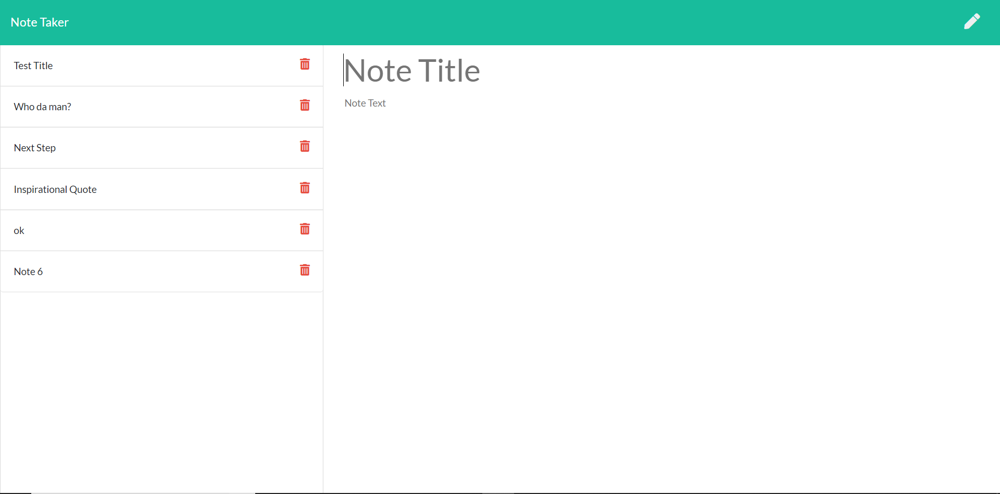

# Note-Taker
Create an application that can be used to write, save, and delete notes. This application will use an express backend and save and retrieve note data from a JSON file.

AS A user, I want to be able to write and save notes 
I WANT to be able to delete notes I've written before 
SO THAT I can organize my thoughts and keep track of tasks I need to complete

  

